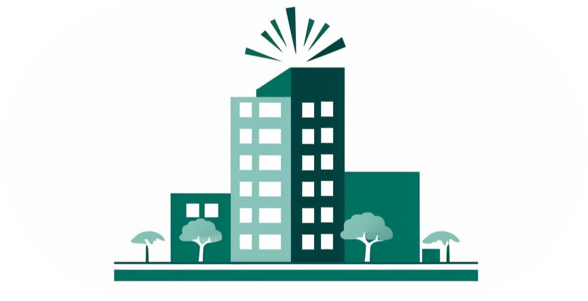
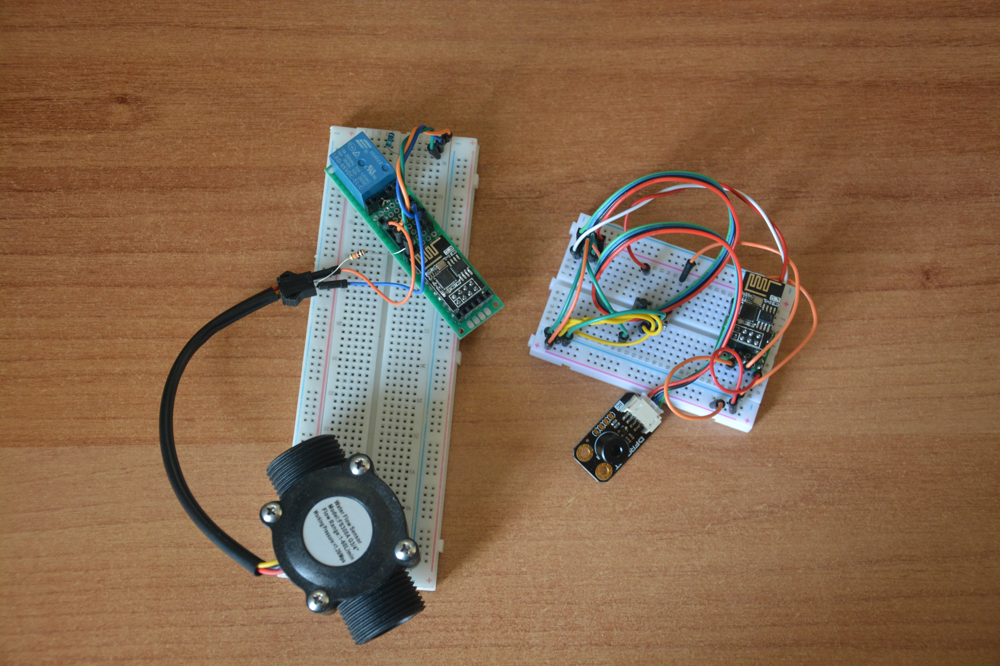
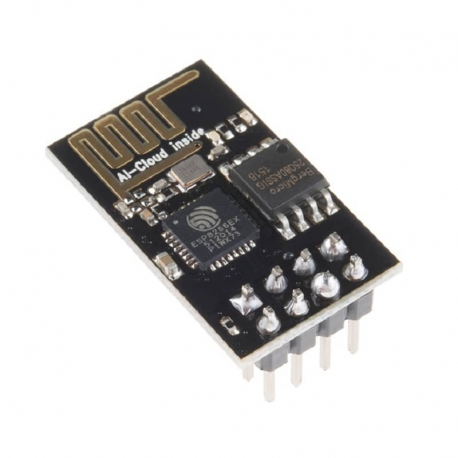
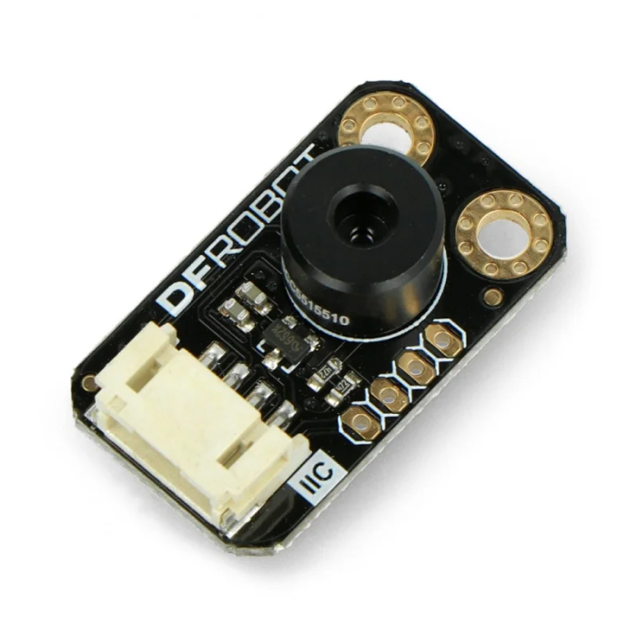
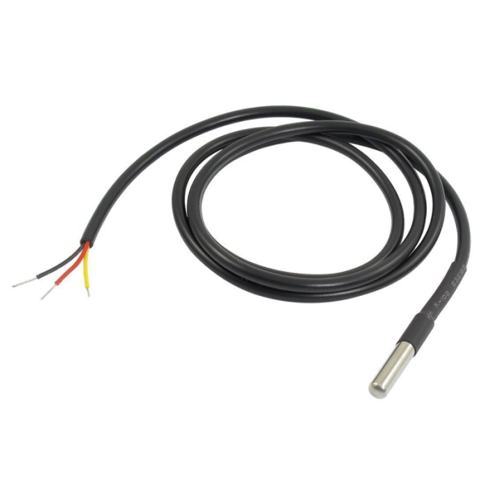
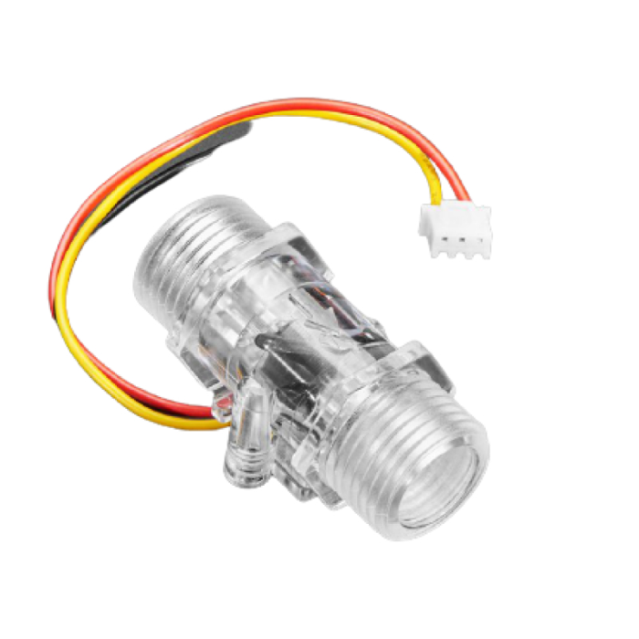
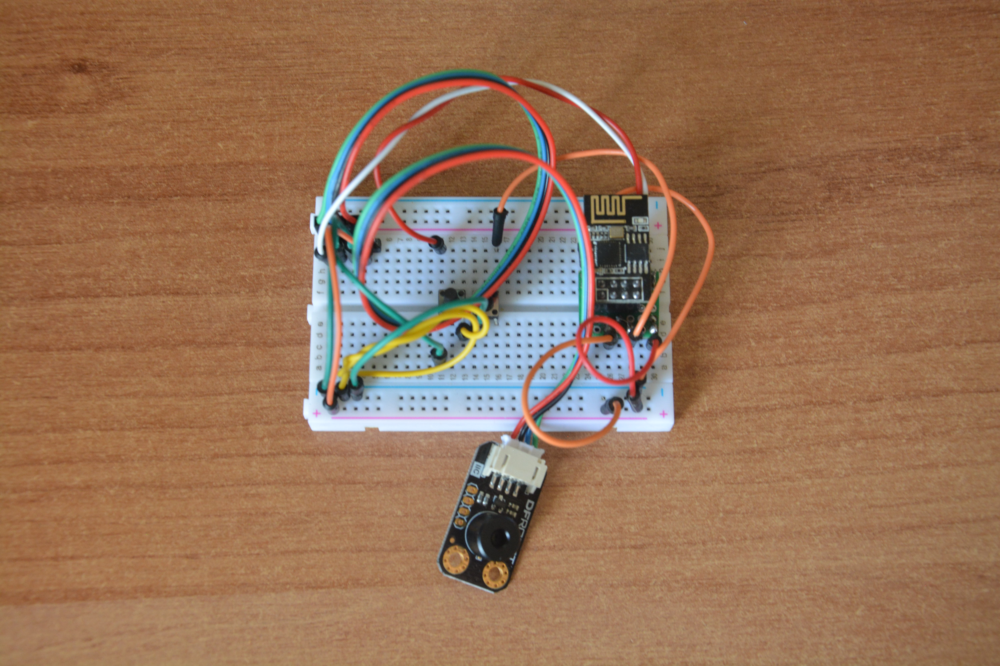
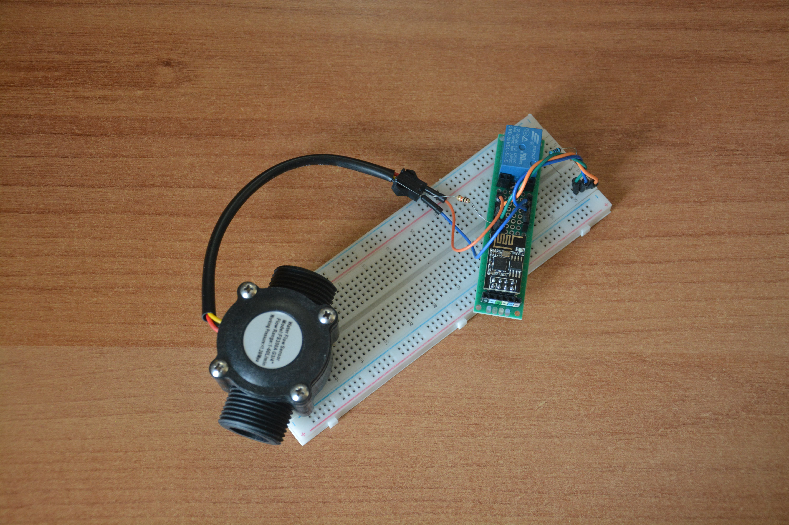
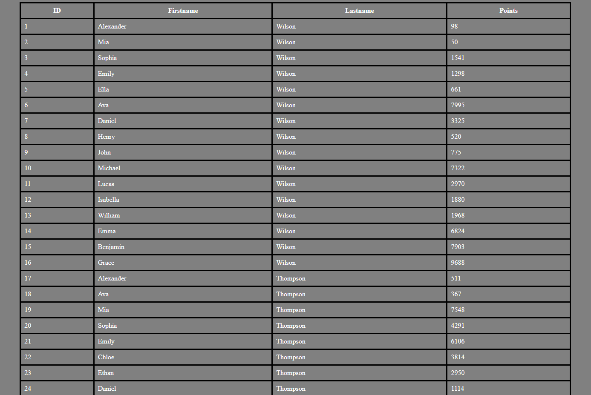

# Green Stay Rewards - GSR
"Join our green revolution: earn rewards for conserving energy while staying cool in your hotel room!"

# Abstract
The aim of this project is to develop a system that monitors the temperature and energy consumption of the air-conditioning units in hotel rooms and 
rewards guests for their conservation efforts. The system utilizes a combination of sensors including IR temperature and I2C temperature sensors to 
monitor the temperature of the rooms. The IR temperature sensor is used to measure the temperature of the air being blown out of the air-conditioning 
unit to determine its energy consumption. The water consumption is measured using a clear turbine flow sensor and DS18B20 temperature sensor, which are 
installed in the water supply line to the room. All sensor data is stored in a database, and guests can earn points based on their conservation efforts, 
which can be redeemed for eco-friendly rewards.

# Components 
**Green Stay Rewards** is a multi-sensor system, each mainly consisting of two parts:

### The Programming and Production Boards
Here you can notice the 2 main boards used to make this project working

|          Arduino Board          |             ESP8266-01             |
|:-------------------------------:|:----------------------------------:|
|  |  |

### The Sensors
|             IR Temperature Sensor             |   DS18B20 Temperature Sensor    |             Flow Sensor             |
|:---------------------------------------------:|:-------------------------------:|:-----------------------------------:|
|  |  |  |

# Functionality
The system continuously monitors the temperature and occupancy of the hotel rooms using the IR temperature sensor, I2C temperature sensor, and occupancy 
sensors. The IR temperature sensor is specifically used to measure the temperature of the air being blown out of the air-conditioning unit, allowing for
the calculation of energy consumption. This data, along with the data from the other sensors, is sent to the Arduino board, which processes the data and
stores it in the database.

The water consumption in the room is measured using a clear turbine flow sensor and DS18B20 temperature sensor, which are installed in the water supply 
line to the room. The data from these sensors is also sent to the Arduino board, which calculates the water consumption and stores it in the database.

Guests earn points based on their conservation efforts, such as reducing energy and water usage. The system uses the data from the sensors to track the 
conservation efforts of the guests and assigns points accordingly. The points earned by guests are stored in the database, and they can redeem them for 
eco-friendly rewards like reusable water bottles, energy-saving light bulbs, etc.

The system sends an alert to the guest when they have earned enough points to redeem for a reward. In addition, the hotel staff can use the data from 
the sensors to identify areas where conservation efforts can be improved, thereby promoting sustainable practices in the hotel industry.

In conclusion, the implementation of this system offers a highly efficient and effective approach to monitoring and encouraging conservation efforts 
within hotel rooms. By utilizing advanced technology and data analysis, it enables hotel staff to closely monitor and manage resource consumption, 
leading to significant reductions in energy and water waste. Moreover, the system promotes sustainable practices by incentivizing guests with 
eco-friendly rewards. By combining technology, awareness, and incentives, this system paves the way for a greener and more sustainable future in the hospitality industry.

# Future work
Future work for this project can include several improvements such as
- Integration of additional sensors: In the future, the system can be improved by integrating additional sensors, such as humidity sensors, air 
quality sensors, and motion sensors. These sensors can provide more information about the room conditions and enable the system to better optimize energy 
usage.
- Machine learning algorithms: The system can be further enhanced by incorporating machine learning algorithms to analyze the data from the sensors 
and make predictions about guest behavior. This can help the system to better understand guest preferences and optimize energy usage accordingly.

- Integration with smart home devices: Future work can involve integrating the system with smart home devices, such as smart thermostats and 
smart lighting systems. This can enable guests to control the room conditions from their mobile devices, further promoting energy conservation.

- Gamification elements: The system can be further improved by adding gamification elements to the point system, such as leaderboards, badges, 
and challenges. This can increase guest engagement and motivation to conserve energy and water.

- Cloud-based storage and analytics: Future work can involve utilizing cloud-based storage and analytics solutions, which can enable real-time
 data analysis and remote access to the system. This can facilitate better management and monitoring of energy and water usage in hotel rooms.

By implementing these future improvements, the system can become more efficient, cost-effective, and user-friendly, ultimately promoting greater 
sustainability and improving the guest experience.

